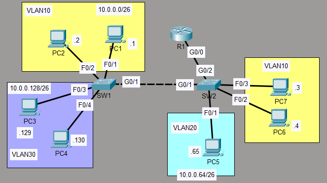

# VLAN & Inter-VLAN Routing Lab

## Overview
This project demonstrates VLAN configuration and inter-VLAN routing using Cisco Packet Tracer.

## Objectives
- Configure VLANs on a switch
- Assign ports to VLANs
- Configure trunking using 802.1Q
- Implement inter-VLAN routing (Router-on-a-Stick)

## Topology

## Configuration Steps
- Configured the switch interfaces connected to PCs as access ports in the correct VLAN.
- Configured the connection between SW1 and SW2 as a trunk, allowing only the necessary VLANs.
- Configured an unused VLAN as the native VLAN.
- Configured the connection between SW2 and R1 using 'router on a stick'.
- Assigned the last usable address of each subnet to R1's subinterfaces.

## Verification
- Verified VLANs using: `show vlan brief`
- Verified trunk using: `show interfaces trunk`
- Tested connectivity by pinging between PCs.

## Technologies Used
- Cisco Packet Tracer
- VLANs
- Inter-VLAN Routing
- 802.1Q Trunking
